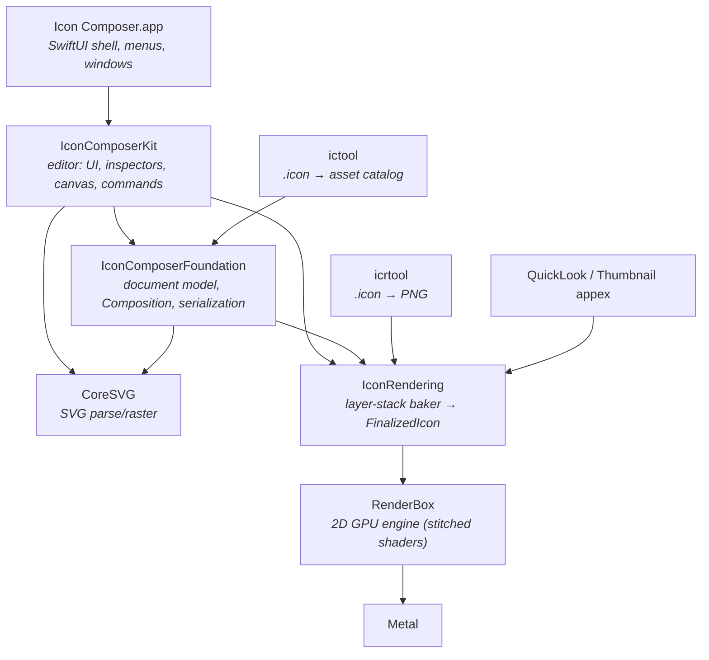
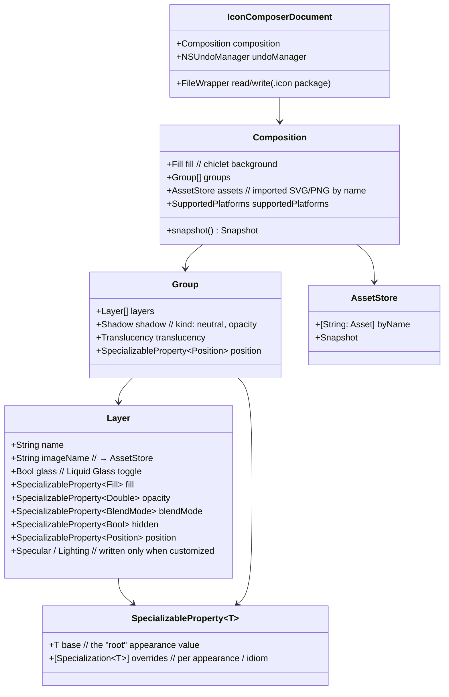
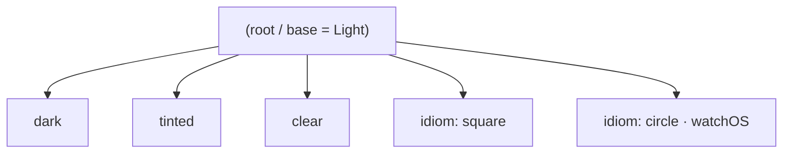
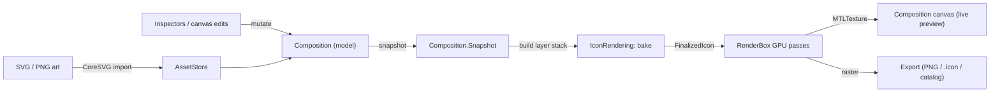
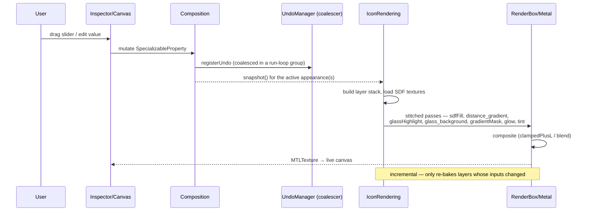
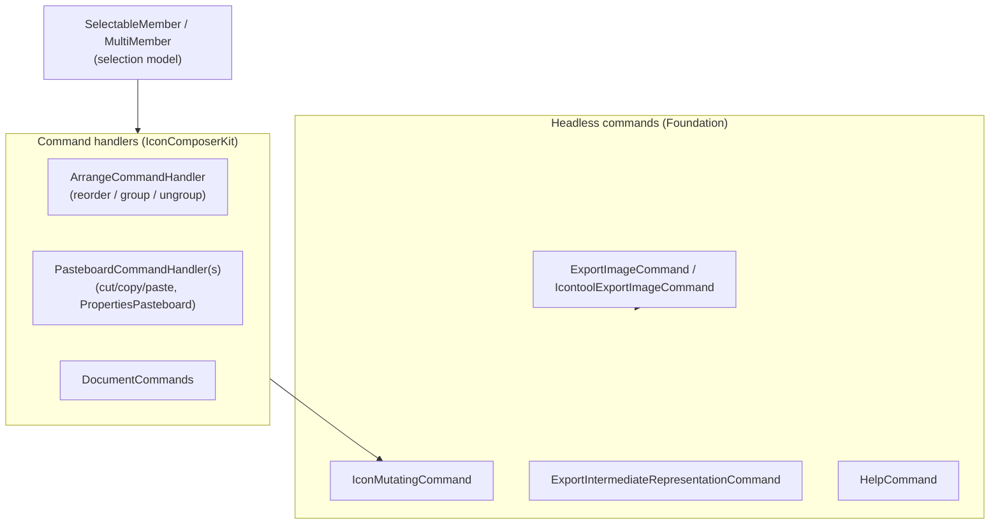
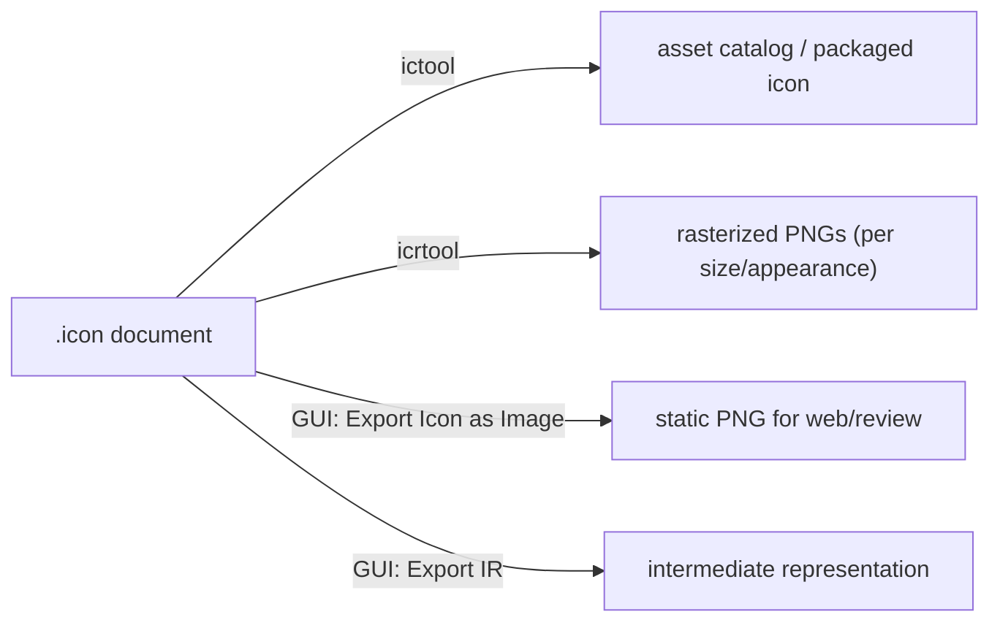

# Icon Composer — editor architecture & logic

How the macOS 27 Icon Composer editor is put together: the layers of code, the document model, the
edit→bake→render→export data flow, undo, and selection. Reconstructed from binary symbols
(`strings` over the app + frameworks) and the reconstructed shaders. Symbol-level; where a name is
inferred it is marked *(inferred)*.

## 1. Layering (who depends on whom)

- **App shell** is thin (~204 KB): SwiftUI `App`, `WindowGroup`, `Commands`, document type binding.
- **IconComposerKit** (6.5 MB) holds the entire editor: the inspector panels, the layer sidebar, the
  composition canvas, command handlers, the color panel, and the export sheet.
- **IconComposerFoundation** (3.6 MB) is the model: the `Composition` object graph, the
  `SpecializableProperty` mechanism, `.icon` (de)serialization, and the headless `ToolCommand`s that
  `ictool`/`icrtool` reuse.
- **IconRendering** turns a composition into a baked `FinalizedIcon`; **RenderBox** is the GPU engine
  it renders through (see [`kernels/icon-glass.md`](kernels/icon-glass.md)).

## 2. Document model

`.icon` on disk is a package (`NSFileWrapper`). In memory it is an `IconComposerDocument` whose
payload is a `Composition` object graph.

### `SpecializableProperty` — the base+override mechanism

Every visual property is a `SpecializableProperty<T>`. It (de)serializes via
`decodeSpecializableProperty(singularKey:pluralKey:)`:

- if only the **singular key** is present (`"fill"`) → a single base value;
- if the **plural key** is present (`"fill-specializations"`) → an array where the entry with **no
  discriminator** is the base and the rest carry `appearance:` or `idiom:` to override.

Appearances form an inheritance tree — a foundation string literally calls the root *"the appearance
all appearances inherit from"*:

Resolving a property for a target appearance = start from `base`, then apply the matching override if
one exists (`value: "none"` disables the property for that appearance).

## 3. Edit → render data flow

The model is **snapshot-based**: edits mutate `Composition`; a `Snapshot` (immutable) is handed to
`IconRendering`, which bakes the layer stack (SDF fills + glass + specular + tint per appearance) into
a `FinalizedIcon`, rendered through RenderBox to an `MTLTexture` for the canvas or rasterized for export.

## 4. Bake / render sequence

Undo edits are **coalesced**: a run-loop observer batches rapid mutations (e.g. a slider drag) into a
single undo group (`undoCoalescingTimer`, `closeCoalescingUndoGroups`,
`ensureNextSequenceOfModificationsIsANewUndoEvent`). Rendering is **incremental** (`Incremental Update`,
texture pool reuse) — only changed layers re-bake.

## 5. Selection & commands

The same `ToolCommand` / `IconMutatingCommand` layer backs both the GUI and the CLIs — the editor and
`ictool`/`icrtool` share one mutation/serialization path. `PropertiesPasteboardCommandHandler` lets you
copy **properties** (a fill, a specular setup) between layers, not just layers themselves.

## 6. Export

- **Export Icon as Image** — *"Export static versions of your icon for use on websites, advertising,
  or for review."* Excluded-glass images note: *"composite over an existing glass chiclet using the
  screen blend mode."*
- **ictool** compiles `.icon` → asset-catalog form Xcode consumes; **icrtool** renders `.icon` → PNGs;
  both drive the same `IconRendering` path headlessly (no window/GPU-context assumptions beyond Metal).

See also: [`README.md`](README.md) (bundle map, `.icon` schema) · [`editor-ui.md`](editor-ui.md)
(windows, menus, inspectors) · [`kernels/icon-glass.md`](kernels/icon-glass.md) (shader math).
