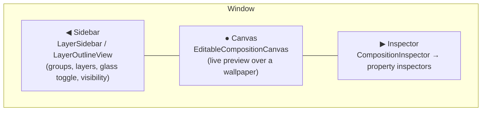

# Icon Composer — UI & menus

The editor surface: window layout, toolbar, layer sidebar, composition canvas, the inspector catalog,
color panel, export sheet, context menus, and the menu bar. Type names are from `IconComposerKit`
symbols; quoted text is verbatim UI copy pulled from the binary. Items marked *(std)* are standard
macOS affordances inferred from the document type; everything else is symbol/string-confirmed.

## Window layout

A three-pane `NavigationSplitView`:

Top: a unified **toolbar** (`AppGridToolbarItem`, `TupleToolbar`). Bottom of canvas: appearance /
preview controls.

## Toolbar & canvas controls

| Control | Type | Copy / purpose |
|---|---|---|
| Add layer/group | `BorderlessButtonMenu` | *"Opens menu to add new group or image layer"* |
| Background chooser | `ButtonMenu` | *"Choose background"* — the 6 `sine-*` wallpapers (in `IconComposerKit/Resources/Backgrounds`) |
| Design generation | `MenuPicker` | *"Choose design generation or disable Liquid Glass effects"* |
| Variation type | menu | *"Opens menu to choose variation type"* |
| Appearance switch | `RadioGroupPicker` / `MultiPicker` | Light / Dark / Tinted / Clear (+ *"Enable or disable tinted appearance"*) |
| Preview size | `Picker` | *"Select preview size"* (`IconPreviewDimensionsSettings`) |
| Effects render mode | `EffectsRenderModePicker` | preview fidelity toggle |
| Export | `ExportSheet` | opens the export sheet |

**Canvas interactions** (`EditableCompositionCanvas`): *"Click to select layers, drag to move. Use
arrow keys for precise positioning."* Numeric fields: *"Drag or use arrow keys to adjust. Hold Shift
with arrow keys for larger increments."*

## Layer sidebar

`LayerSidebar` → `LayerOutlineView` / `ICOutlineView` (an `NSOutlineView`-backed tree).

- Tree of **Groups → Layers**; drag to reorder / re-parent (`ArrangeCommandHandler`).
- Per-row: name (`RoundedBorderTextField` rename), **visibility toggle** (*"Toggle visibility"*),
  **glass toggle** (*"Enable or disable glass effects on this layer"* → the `glass` field).
- Row context menu; multi-select drives the inspectors (`SelectableMember` / `MultiMember`).
- *"The background layer cannot be edited in Mono mode."* — the chiclet background is special-cased.

## Inspector catalog (right pane)

`CompositionInspector` hosts a stack of property inspectors. When multiple layers are selected,
`MultiToggle` shows mixed state (*"Toggles all selected values. Currently some are on and some are
off."*). Every value is a `SpecializableProperty` → each inspector can hold **per-appearance overrides**.

| Inspector | Edits | Notes / UI copy |
|---|---|---|
| `FillInspector` | fill: solid / gradient / image | color via the color panel; gradient stops + `orientation` |
| `BlurMaterialInspector` | the glass blur material | per-appearance specializable |
| `BlendModeInspector` | layer blend mode | `blendMode` (+ specializations) |
| `LayerSpecularInspector` / `GroupSpecularInspector` | specular highlights | *"Crisp, specular highlights elevate and define each layer, preserving contrast at the edges. Choose how highlights align with each layer, either **inside** or **outside**, or let Icon Composer decide **automatically**."* → `CUIThemeSpecularPlacement` |
| `GroupEffectsInspector` | group-level effects | `RefractivityView`, stroke/border (`StrokeShapeView`) |
| `ShadowInspector` | shadow | `kind: neutral`, `opacity` |
| `TranslucencyInspector` | translucency | `enabled`, `value` |
| `OpacityInspector` | opacity | `OpacityVarying` |
| `ImageAssetInspector` | the layer's source image | swap / reveal asset |
| `DocumentSettingsInspector` | document-wide | platforms, color handling |

Common widgets: `NumericTextField` / `MultiNumericTextField`, `LabeledControl`, `InlinePicker`,
`RadioGroupPicker`, `Popover`, `ColorChip`.

## Color panel

`ColorPanelCoordinator` bridges `NSColorPanel`. `ColorPickerGrid` + `ColorChip` + `ColorSlider` give
presets and custom colors (*"Opens color preset menu"*). Colors round-trip as colorspace-prefixed
tuples (`srgb:` / `display-p3:` / `gray:`) — **P3 native**.

## Document settings

- **Platforms** — `PlatformSelection`; `supported-platforms` maps idioms (`squares` / `circles`) to
  platforms. Guard: *"Please turn on at least one platform."*
- **SVG color handling** — *"Treat colors in SVGs without a color profile as Display P3."*
- **Localization** — `LocalizationMenu` / `Delete Localization` (per-locale icon variants).

## Export sheet

`ExportSheet` / `ExportImageCommand`:

- **Export Icon as Image** — *"Export static versions of your icon for use on websites, advertising,
  or for review."* Can emit **HDR HEIC** or **PNG** renditions.
- Glass-excluded export note: *"When excluded, the exported image should be composited over an existing
  glass chiclet using the screen blend mode."*
- Headless equivalents: `ictool` (→ asset catalog) and `icrtool` (→ PNG), plus
  `ExportIntermediateRepresentationCommand`.

## Context menus

- `AllVariantsContextMenu` / `AllVariantsContextMenuModifier` — act across all appearance variants at
  once.
- `SliceContextMenu` — per-slice (size/appearance cell) actions.
- `PropertiesPasteboardCommandHandler` — **copy/paste properties** (e.g. a specular or fill setup)
  between layers, not just the layers.

## Menu bar & commands

Backed by SwiftUI `Commands` (`DocumentCommands`) + command handlers. Confirmed items in **bold**;
*(std)* = standard macOS document-app menu inferred from the `.icon` document type.

```mermaid
graph TD
    MB["Menu bar"]
    MB --> File
    MB --> Edit
    MB --> View
    MB --> Layer
    MB --> Help

    File --> f1["New / Open / Open Recent (std)"]
    File --> f2["Save · Save As… (std)"]
    File --> f3["<b>Export Icon as Image…</b>"]
    File --> f4["Export Intermediate Representation"]

    Edit --> e1["<b>Undo / Redo</b> (coalesced)"]
    Edit --> e2["Cut · Copy · Paste (std)"]
    Edit --> e3["<b>Duplicate</b> · <b>Delete</b>"]
    Edit --> e4["<b>Copy/Paste Properties</b>"]
    Edit --> e5["<b>Localization ▸</b> (add / Delete Localization)"]

    View --> v1["<b>Appearance ▸</b> Light/Dark/Tinted/Clear"]
    View --> v2["<b>Background ▸</b> (sine-* wallpapers)"]
    View --> v3["<b>Preview Size ▸</b>"]
    View --> v4["Show/Hide Sidebar · Inspector (std)"]

    Layer --> l1["<b>Add Group / Add Image Layer</b>"]
    Layer --> l2["<b>Toggle Glass</b> · <b>Toggle Visibility</b>"]
    Layer --> l3["<b>Arrange ▸</b> (reorder / group / ungroup)"]
    Layer --> l4["<b>Reset</b>"]

    Help --> h1["Icon Composer Help"]
```

> Menu **titles/grouping** are partly inferred (SwiftUI generates them); the **commands** listed in
> bold are confirmed from `ExportImageCommand`, `DocumentCommands`, `ArrangeCommandHandler`,
> `PasteboardCommandHandler`, `PropertiesPasteboardCommandHandler`, `LocalizationMenu`, and the
> add-layer/glass/visibility strings. Keyboard shortcuts weren't recoverable from static strings.

See also: [`editor-architecture.md`](editor-architecture.md) (model, data flow, undo) ·
[`README.md`](README.md) (`.icon` schema) · [`kernels/icon-glass.md`](kernels/icon-glass.md).
