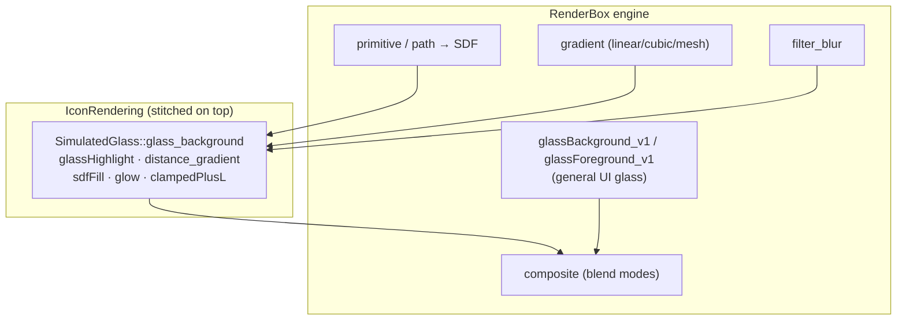

# RenderBox — the 2D GPU engine (`RenderBox.framework/default.metallib`)

RenderBox is Apple's retained-mode 2D vector GPU engine that Icon Composer (and SwiftUI) render
through. Its `default.metallib` (1.95 MB) holds **100+ modules**; the icon glass in
[`kernels/icon-glass.md`](kernels/icon-glass.md) is *stitched onto* this engine. Extracted to IR with
llvmlite (`air64_v26-apple-macosx14.0.0` AIR, parses clean).

## Kernel roster (by family)

| Family | Kernels | Purpose |
|---|---|---|
| **Render pipes** | `accumulator_{color,coverage,custom,gradient,image,mesh_gradient}_{fragment,vertex}` (+ `_depth`) | the core draw pipes (accumulate coverage/color into the target) |
| **Mask** | `mask_{color,coverage,gradient,image,accumulate}_fragment` (+ vertex) | masked draws |
| **Plane** | `plane_color_fragment`, `plane_image_stretch_{fragment,vertex}` | flat image/color planes |
| **Path** | `path_{interior,exterior,edges}_{fragment,vertex}`, `path_distance_{fragment,vertex}`, `path_distance_shape` | **vector path fill/stroke + path→SDF** |
| **Filter** | `filter_blur_fragment`, `filter_color_fragment`, `filter_distance_fragment`, `filter_custom_*` | blur / color-matrix / distance-field filters |
| **Gradient** | `Gradient::{value,color,color_out,fold_value}`, `sample_stops_{uniform,binary}`, `sample_mesh_gradient`, `mesh_gradient_vertex`, `gradient_vertex` | linear/cubic **+ mesh** gradients with uniform/binary stop tables |
| **Composite** | `RB::Shader::composite` (×100 refs), `composite_color`, `composite_coverage` | the blend/composite core (blend modes, `saturation`, `pdf_mode`) |
| **Primitive** | `primitive_{color,shape,distance,vertex}` | SDF primitives (rounded-rect/squircle etc.) |
| **Alpha/Custom effect** | `alpha_effect_{fragment,vertex}`, `custom_effect_*` | pluggable effects (Highlight, Displacement — see `RB::Shader::AlphaEffectGlobals::{Highlight,Displacement}`) |
| **Stitched effects** | `glassBackground_v1`, `glassForeground_v1`, `displacementMap_v1`, `distanceGradient_v1`, `ovalizeGradient_v1` | **the Liquid Glass + displacement stitched kernels** |

> **Two glass implementations coexist in the app:** RenderBox's `glassBackground_v1`/`glassForeground_v1`
> are the **general UI Liquid Glass** (the QuartzCore family you already reconstructed in
> [`../liquid-glass/kernels/glass-background.md`](../liquid-glass/kernels/glass-background.md) /
> `glass-foreground.md`); IconRendering's `SimulatedGlass::*` are the **icon-specific** variants. Icon
> Composer links both.

## `glassForeground_v1` — uniform layout (decoded)

287 IR instructions; the param buffer (`ptr addrspace(2) %2`, `constant float*`) layout:

| offset (float) | meaning |
|---|---|
| `0,1` | height remap: `height = sdf*p0 + p1` |
| `2,3` | normal remap: `n = sample.gb * p2 + p3` |
| `4,5,6` | bevel params (inset/width/bias-like) |
| `16,17` | **light direction as (cos, sin)** → rotates the normal: `dot(n,(cos,-sin))`, `dot(n,(sin,cos))` |
| `18..27` | RB::Layer #1 affine transform (5×float2: m0,m1,t,lo,hi) |
| `28..37` | RB::Layer #2 affine transform (5×float2) |

Structure: sample the height/normal texture through the layer transform; early-out where
`sample.a < 0.157`; remap height (fwidth-antialiased); **rotate the surface normal by the (cos,sin)
light direction**; apply bevel falloff → the directional foreground lighting + chromatic streak. This
is the same bevel+specular as [`../liquid-glass/kernels/glass-foreground.md`](../liquid-glass/kernels/glass-foreground.md);
the macOS-27 layout above lets you diff it against your QuartzCore port.

## `displacementMap_v1` — structure

`(pos, color, params, layerA=displacementTex, layerB=contentTex)`. `param[0]` = displacement
`amount` (`amt*2`, `-amt` → decode a `[0,1]→[-1,1]` vector); `param[1..10]` = displacement-tex xform,
`param[11..20]` = content-tex xform. Samples the displacement map, decodes an offset vector, and
re-samples the content displaced by `amount * vector`. Classic displacement warp (the
`chromatic-displacement` primitive from the liquid-glass ref).

## `glassBackground_v1` — the big one (structure + status)

**1294 IR instructions** — the full production Liquid Glass background: refraction (Snell edge
lensing) + SDF/bleed + backdrop blur + variants. Signature:
`(float2 pos, half4 color, constant float* params, ..., layer content, layer normal, ...) -> half4`.

This is the **same kernel family** as
[`../liquid-glass/kernels/glass-background.md`](../liquid-glass/kernels/glass-background.md) (already
reconstructed & IR-verified from QuartzCore). Rather than duplicate a 1294-line hand-trace, treat the
existing floyd doc as the reference and **diff** the macOS-27 RenderBox version against it. A full
line-by-line reconstruction of *this* copy is a worthwhile focused follow-up if a divergence is found.

> **distanceGradient_v1 / ovalizeGradient_v1** — RenderBox's own SDF-gradient and oval-warp helpers
> (analogous to IconRendering's `distance_gradient`); reconstruct on demand.

## Relationship to the icon pipeline

See also: [`kernels/icon-glass.md`](kernels/icon-glass.md) (icon shader math) ·
[`editor-architecture.md`](editor-architecture.md) (where RenderBox sits) ·
[`../liquid-glass/`](../liquid-glass/) (the QuartzCore glass reference to diff against).
