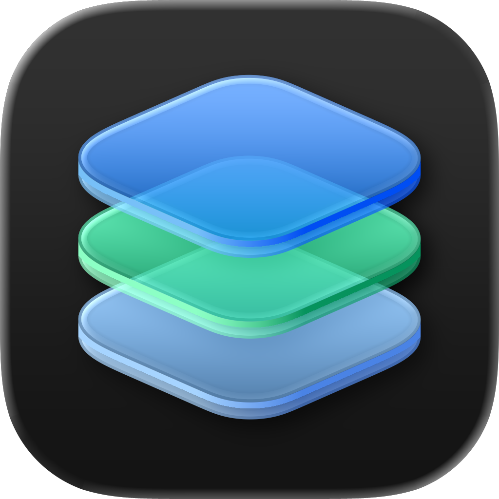

<p align="center">
  
  <h1 align="center">Icon Composer</h1>
  <p align="center">
    <strong>Apple's Icon Composer, decoded and rebuilt outside macOS: the <code>.icon</code> format, the Liquid Glass icon renderer and the editor, in C++23 and Vulkan.</strong>
  </p>
  <p align="center">
    
    
    
    
    
  </p>
</p>

---

Icon Composer is a reverse-engineering of the application Apple ships for authoring layered Liquid Glass icons, with one goal: full support for `.icon` documents outside macOS. It reads and writes the format, draws the icon the way `IconRendering` and `RenderBox` do, and edits it in a native window. It is a clean reimplementation: what the code asserts was decoded from Apple's binaries or measured over real documents, and it carries the seal that says which. Icon Composer is an independent project and is not affiliated with Apple.

The icon above is Apple's own Icon Composer icon. It was rebuilt from the compiled `Assets.car` of the application by `scripts/car_to_icon.py` and drawn by this repository's renderer.

## How it is built

| Seal | Meaning |
|---|---|
| `[BIN]` | Decoded from the Apple binary, with the address. The source of truth. |
| `[ART]` | Measured over the corpus: 145 real `.icon` documents collected from public repositories. |
| `[INF]` | An inference, written down as one, with what it rests on. |
| `[OBS]` | An open observation. A question, never a final source. |

A value with no seal is an open question and stays documented as one. The investigations live in [`Docs/Laudos/`](Docs/Laudos/). Apple's disk images, the extracted bundles and the corpus stay out of git (`References/`); only the provenance of each build is committed.

## Architecture

Code lives in `Source/<Image>/`, one directory per Apple image it answers for, in dependency order:

| Tower | Answers for |
|---|---|
| `IconComposerFoundation` | The document: `icon.json`, the bundle, specialization resolution, typed values, lexeme-preserving edits |
| `CoreSVG` | The SVG the layers are drawn from: XML, paths, paint, gradients, clip, mask, filters |
| `RenderBox` | The renderer: coverage, compositing, blend modes, and the glass of the icon (shadow, translucency, specular, refraction), on Vulkan, with a CPU reference |
| `IconComposerKit` | The editor's panels over Dear ImGui: layers, canvas, inspector, renditions, menus |
| `app` | The window: a Win32 shell composed with DirectComposition on Windows, GLFW elsewhere |
| `cli` | The command-line tools below |

A second front end, in `ui/`, is the same editor in Tauri and React, talking to `icserver`.

## Tools

| Tool | Does |
|---|---|
| `iconcomposer [document.icon]` | The editor |
| `ictool <document.icon>` | Says what a bundle holds: the composition resolved under an appearance and an idiom, the asset references, the canonical `icon.json`. No GPU |
| `icrender <document.icon \| file.svg> --out <file.png>` | Renders an icon or a single SVG to PNG (`--size`, `--appearance`, `--idiom`, `--gpu`) |
| `icfidelity` | Compares the GPU path against the CPU reference over the corpus |
| `icserver` | The render server the Tauri front end talks to |
| `python scripts/car_to_icon.py <Assets.car> --out <Name.icon>` | Rebuilds the `.icon` bundle a compiled asset catalog carries: layers, groups, fills, glass properties and the per-appearance variants |

## Status

Early. The format is read and written, the renderer draws the corpus, and the editor opens, edits and saves. The render does not yet match Apple's pixel for pixel: the measured differences against the two icons Apple ships rasterized are recorded where they were measured, not smoothed over. What is decoded, what passes its gate and what is still open is kept, line by line, in [`Docs/README.md`](Docs/README.md).

## Build and run

Requires CMake 3.28+, Ninja, a C++23 compiler (MinGW-w64 GCC 13 or MSVC) and the Vulkan SDK. Dear ImGui and GLFW are fetched.

```powershell
cmake --preset mingw-release
cmake --build --preset mingw-release
.\build\mingw-release\Source\app\iconcomposer.exe path\to\Document.icon
```

`IC_BUILD_UI=OFF` builds the towers and the command-line tools without the editor. The editor loads Apple's symbols and window controls at run time from `ui/public/apple`, which is not in git; `IC_APPLE_ASSETS` points it elsewhere.

### Tests

The suite is one executable and is not part of `all`. The corpus gates need the corpus:

```powershell
cmake --preset mingw
cmake --build build/mingw --target ic_tests
$env:IC_CORPUS_DIR = "<repo>/References/corpus"
.\build\mingw\Tests\ic_tests.exe
```

`scripts/fetch-icon-corpus.py` collects the corpus.

## Where to look

| Question | Where |
|---|---|
| Where to start, and what is decided | [`Docs/00-levantamento.md`](Docs/00-levantamento.md) |
| The `.icon` document: keys, vocabularies, specializations | [`Docs/01-o-formato-icon.md`](Docs/01-o-formato-icon.md) |
| The bundle around it | [`Docs/02-o-bundle-icon.md`](Docs/02-o-bundle-icon.md) |
| How the icon is drawn | [`Docs/03-o-motor-de-render.md`](Docs/03-o-motor-de-render.md) |
| What the SVG reader accepts, and what Apple's does | [`Docs/04-o-svg.md`](Docs/04-o-svg.md) |
| What was decoded, investigation by investigation | [`Docs/Laudos/`](Docs/Laudos/) |
| The compiled icon inside an `Assets.car` | the header of [`scripts/car_extract.py`](scripts/car_extract.py) |
| Where the binaries come from | [`References/README.md`](References/README.md) |

The documentation is written in Portuguese.

---

<p align="center">
  Made by <a href="https://github.com/JeanxPereira">JeanxPereira</a>
</p>
